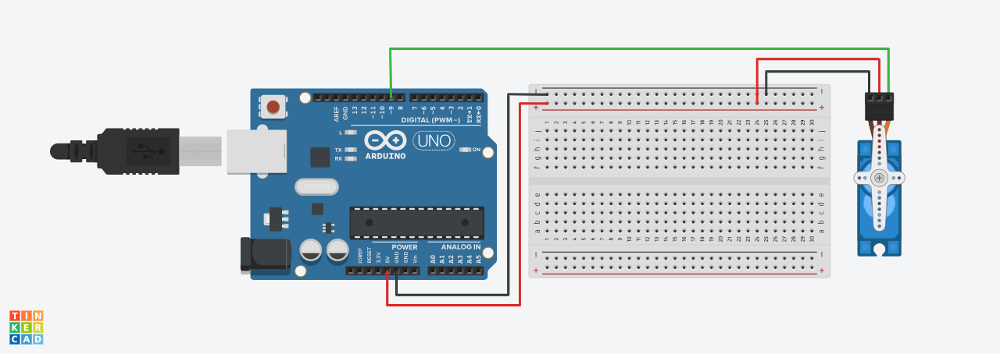
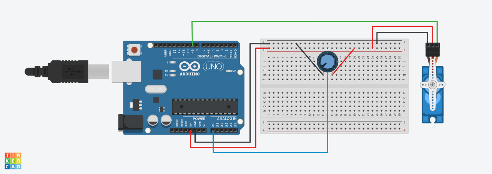
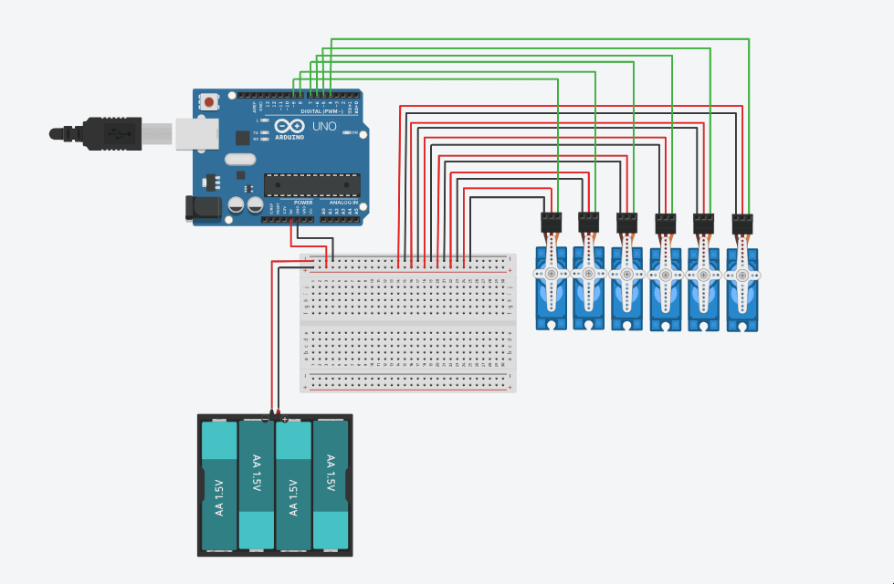

# Servo-Motors-Programming

## Project Description  
The goal of this project is to program and simulate servo motor control for a humanoid robot using Arduino. The tasks are as follows:
- Program 6 servo motors to perform the following actions:
  - Run using the built-in Sweep example for 2 seconds.
  - After that, set all motors to hold at 90 degrees.

- Design and write an algorithm that describes how the walking motion will be executed for the humanoid robot using these servo motors.
  

## Components Used
- Arduino Uno  
- 6 × SG90 Servo Motors  
- Breadboard  
- Jumper Wires  
- USB Cable  
- Optional: External power supply for servos 
- Tinkercad for virtual simulation and wiring

## What is a Servo Motor?  

A servo motor is a small device with an output shaft that can be positioned to specific angular positions by sending it a coded signal. It is commonly used in robotics and motion-based projects.

###  SG90 Servo Motor Specifications:
- Operating Voltage: 4.8V – 6.0V  
- Stall Torque: 1.8 kg/cm  
- Speed: 0.1s/60° at 4.8V  
- Control Method: PWM (Pulse Width Modulation)  
- Rotation Range: 0° to 180°  
- Weight: ~9g  

###  Applications:
- Humanoid robots  
- Robotic arms  
- RC planes/cars  
- Animatronics  

##  Servo Control Methods

There are two basic methods for controlling servo motors using the Arduino IDE. Both are available as built-in examples:

### 1️. Sweep

- The servo automatically moves back and forth between 0° and 180°.
- Useful for testing servo functionality and understanding the basic motion pattern.

####  Wiring (for one SG90 servo)

| Servo Wire      | Arduino Pin     |
|------------------|------------------|
| Red (VCC)        | 5V               |
| Black (GND)      | GND              |
| Green (Signal)   | Digital Pin 9    |

>  **Note:** Pin 9 is used in the example code, but **any digital pin can be used**. Just make sure to update the pin number in the code accordingly.

####  Tinkercad circuit diagram – Sweep setup  

### 2️. Knob

- Allows you to manually control the servo angle using a potentiometer.
- Ideal for interactive testing and real-time angle control.

####  What is a Potentiometer?

A **potentiometer** is a variable resistor that lets you adjust resistance by rotating a knob. In this setup, it's used to change the servo’s angle interactively.

####  Wiring (requires potentiometer)
In addition to the servo wiring above, connect a potentiometer as follows:
- One side to **5V**
- The other side to **GND**
- Middle pin to **Analog Pin A0**

####  Tinkercad circuit diagram – Knob setup  

##  How to Access the Code for both
1. Open Arduino IDE
2. Navigate to: File > Examples > Servo > Knob / Sweep

## 6-Servo Sweep Example 
This section demonstrates how to control six SG90 servo motors using the Arduino Sweep method.
Each servo performs a sweeping motion (from 0° to 180°) for 2 seconds, after which all servos hold their position at 90°.

🔗 [View the Arduino code here](Sweep.ino)

